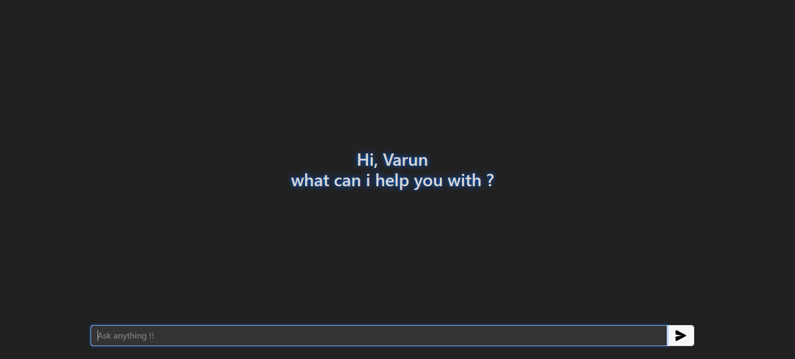

# 💬 AI Chat Application

An interactive AI chat application built with **Node.js**, **Express**, and **Gemini API**.  
It allows users to type in queries and get real-time AI-generated responses.

---

## 🚀 Features
- Simple and clean **chat UI**.
- AI remembers the conversation history.
- **Markdown support** for formatted responses.
- Shows a **"Generating..."** animation while waiting for replies.
- Supports **Enter key** to send messages quickly.

---

## 🖼️ Demo

---

## ⚙️ Setup

### 1. Clone the repository
`git clone https://github.com/Varun04-pixel/AI-Chat`

### 2. Install dependencies
`npm install`

### 3. Create .env file
Inside the project root, create a .env file and add your Gemini API key:
`GEMINI_API_KEY=your_api_key_here`
get the API key from [gemini-api](https://aistudio.google.com/welcome?utm_source=google&utm_medium=cpc&utm_campaign=FY25-global-DR-gsem-BKWS-1710442&utm_content=text-ad-none-any-DEV_c-CRE_726176536025-ADGP_Hybrid%20%7C%20BKWS%20-%20EXA%20%7C%20Txt-Gemini-Gemini%20API-KWID_43700081658540311-aud-2301157399655:kwd-927524447508&utm_term=KW_gemini%20api-ST_gemini%20api&gclsrc=aw.ds&gad_source=1&gad_campaignid=20860602951&gbraid=0AAAAACn9t648zGZXs2kFuOv6Yc7kIZDwY&gclid=Cj0KCQjww4TGBhCKARIsAFLXndTnMnQSezBHRIRgTnNW5cksSvseTIyelb1hrYre-LTH5-PSm1Tn9jcaApmVEALw_wcB)

### 4. Start the server
`nodemon server.js`
runs app on [http://localhost:3000](http://localhost:3000)
